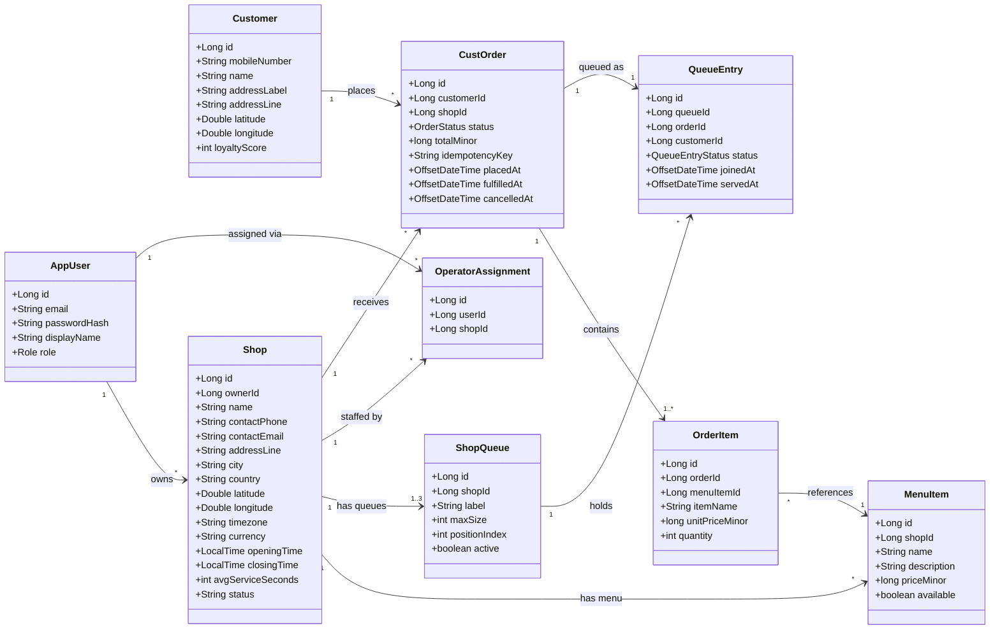
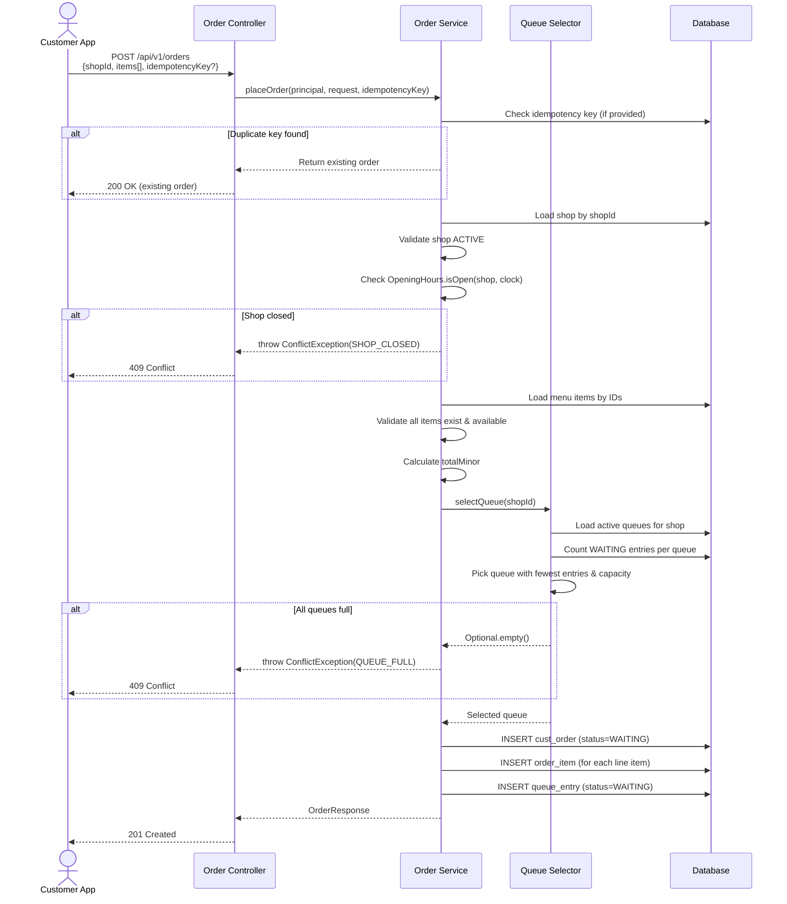
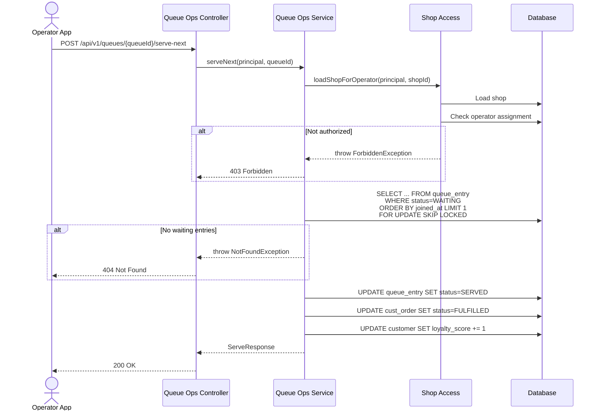
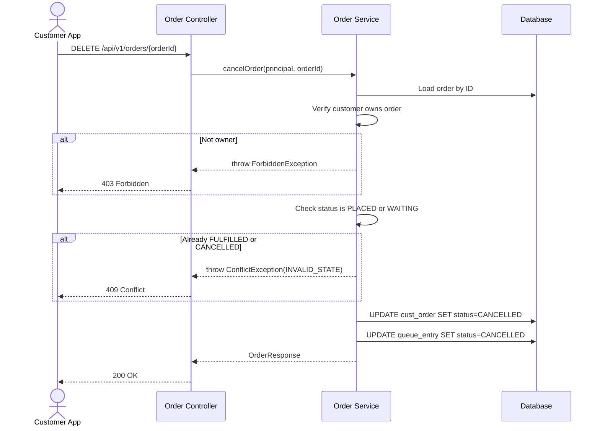
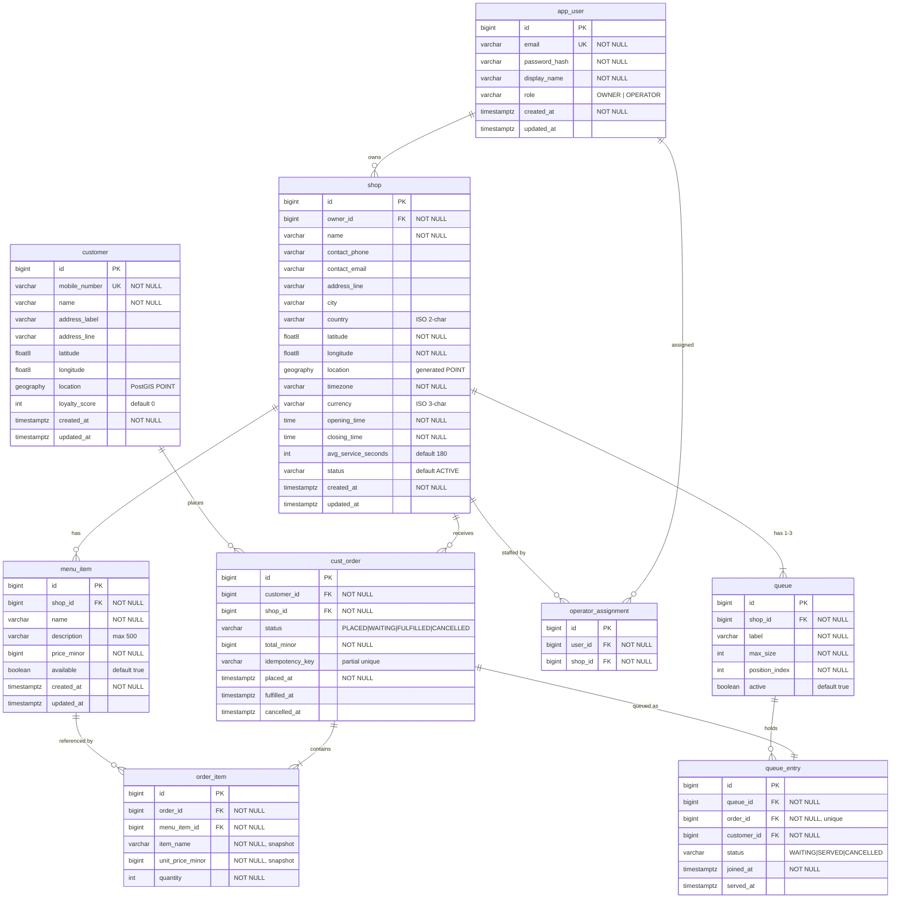
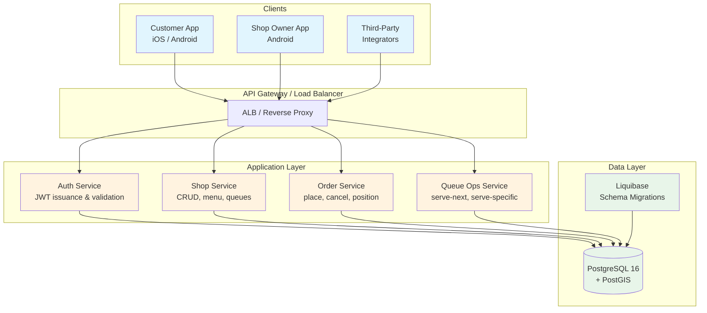

# Solution Design — Coffee Shop Pre-Order Platform

## 1. Overview

A global coffee shop chain needs a platform enabling customers to pre-order coffee for pickup via mobile apps. The platform serves two audiences:

- **Shop owners/operators** — configure shops, manage menus, and process queue orders
- **Customers** — find nearby shops, place orders, track queue position, and cancel if needed

This document covers the Customer App design. The platform exposes a RESTful API consumed by native mobile apps (iOS + Android) and potentially third-party integrators.

## 2. Use Cases

### UC-1: Customer Registration

| Field | Detail |
|-------|--------|
| **Actor** | New customer |
| **Precondition** | Customer does not have an existing account |
| **Trigger** | Customer opens the app and selects "Register" |
| **Main Flow** | 1. Customer enters mobile number, name, and address (home or work) 2. System validates inputs (unique mobile number, required fields) 3. System creates the customer record with loyalty score = 0 4. System issues a JWT token 5. Customer is logged in |
| **Extensions** | 1a. Mobile number already registered → return `409 EMAIL_TAKEN` error |
| **Postcondition** | Customer account exists; customer holds a valid session token |

### UC-2: Find Nearest Coffee Shops

| Field | Detail |
|-------|--------|
| **Actor** | Registered customer |
| **Precondition** | Customer is authenticated; device location is available |
| **Trigger** | Customer opens the "Find Shops" screen |
| **Main Flow** | 1. App sends customer's GPS coordinates to the API 2. System queries shops within a configurable radius (default 5 km) using PostGIS geospatial index 3. System returns shops ordered by distance, filtered to ACTIVE status 4. Customer views shop list with name, address, distance, and opening hours |
| **Extensions** | 2a. No shops within radius → return empty list |
| **Postcondition** | Customer sees a list of nearby shops |

### UC-3: Place an Order

| Field | Detail |
|-------|--------|
| **Actor** | Registered customer |
| **Precondition** | Customer is authenticated; a shop is selected |
| **Trigger** | Customer submits an order from a shop's menu |
| **Main Flow** | 1. Customer selects menu items and quantities 2. App sends the order (shop ID, items, optional idempotency key) 3. System validates: shop is active, shop is currently open (timezone-aware), all menu items exist and are available 4. System selects the least-loaded queue with capacity 5. System creates the order (status = WAITING), snapshots item names and prices, creates a queue entry 6. System returns the order details with total price |
| **Extensions** | 3a. Shop is closed → `409 SHOP_CLOSED` 3b. Menu item unavailable → `400 BAD_REQUEST` 4a. All queues full → `409 QUEUE_FULL` 2a. Duplicate idempotency key → return existing order (no new creation) |
| **Postcondition** | Order exists with status WAITING; customer is in a queue |

### UC-4: Check Queue Position

| Field | Detail |
|-------|--------|
| **Actor** | Customer with an active order |
| **Precondition** | Order exists with status WAITING |
| **Trigger** | Customer opens the order detail screen |
| **Main Flow** | 1. App requests queue position for the order 2. System counts how many entries are ahead in the same queue (by join time) 3. System calculates ETA = position × shop's average service time 4. System returns position (1-based) and ETA in seconds |
| **Postcondition** | Customer knows their place in line and expected wait |

### UC-5: Cancel Order / Exit Queue

| Field | Detail |
|-------|--------|
| **Actor** | Customer with an active order |
| **Precondition** | Order is in PLACED or WAITING status |
| **Trigger** | Customer taps "Cancel Order" |
| **Main Flow** | 1. App sends a DELETE request for the order 2. System verifies the customer owns the order 3. System sets order status to CANCELLED, timestamps the cancellation 4. System sets the queue entry status to CANCELLED 5. System returns the updated order |
| **Extensions** | 2a. Order already FULFILLED or CANCELLED → `409 INVALID_STATE` |
| **Postcondition** | Order is cancelled; queue slot is freed for other customers |

### UC-6: View Order History

| Field | Detail |
|-------|--------|
| **Actor** | Registered customer |
| **Precondition** | Customer is authenticated |
| **Trigger** | Customer opens "My Orders" |
| **Main Flow** | 1. App requests the customer's order history 2. System returns all orders for this customer (all statuses) with item details |
| **Postcondition** | Customer sees their past and current orders |

## 3. Domain / Concept Model



## 4. Sequence Diagrams

### 4.1 Place Order



### 4.2 Serve Next (Operator)



### 4.3 Cancel Order (Customer)



## 5. Data Design (ER Diagram)



### Key Design Decisions

| Decision | Rationale |
|----------|-----------|
| Prices stored as `bigint` minor units (cents) | Avoids floating-point rounding errors in currency calculations |
| `order_item` snapshots `item_name` and `unit_price_minor` | Decouples order history from menu changes; a price change doesn't rewrite history |
| `idempotency_key` has a partial unique index (non-null only) | Enables at-most-once order placement without constraining orders that don't use idempotency |
| PostGIS `geography` column on `shop` | Enables accurate great-circle distance queries across multiple geographies |
| `queue_entry.joined_at` determines FIFO order | Simple, chronologically correct ordering; no sequence gaps on cancellation |
| `FOR UPDATE SKIP LOCKED` on serve operations | Prevents double-serving under concurrent operator access without blocking |

## 6. Data Flow Diagram



### Data Flow: Place Order

```
Customer App
  → POST /api/v1/orders (JSON: shopId, items[])
    → JwtAuthFilter: extract & validate Bearer token
      → OrderController: deserialize + Bean Validation
        → OrderService.placeOrder():
          1. Check idempotency key → cust_order table
          2. Load shop → shop table
          3. Validate open hours → OpeningHours utility
          4. Load menu items → menu_item table
          5. Select queue → queue + queue_entry tables
          6. INSERT cust_order → cust_order table
          7. INSERT order_items → order_item table
          8. INSERT queue_entry → queue_entry table
        ← OrderResponse (JSON)
      ← 201 Created
    ← HTTP Response with X-Trace-Id header
  ← Display order confirmation
```
