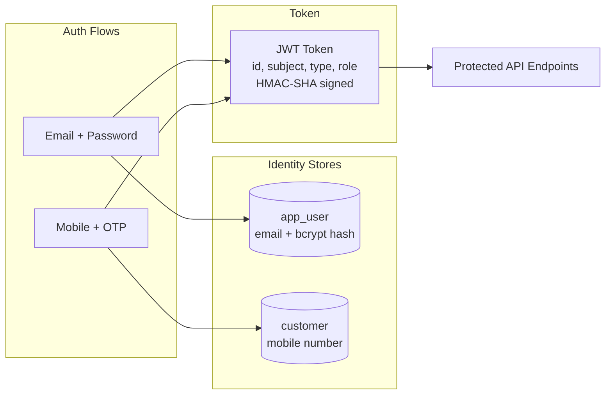

# Security Solution

## 1. Overview

The platform uses stateless JWT authentication with role-based access control. There are two separate identity stores — staff (email + password) and customers (mobile + OTP) — unified under a single JWT token format.



## 2. Authentication

### 2.1 Staff Authentication (Owner / Operator)

| Step | Detail |
|------|--------|
| Registration | `POST /api/v1/auth/owner/register` — email + password + displayName |
| Password storage | BCrypt hash via `BCryptPasswordEncoder` (adaptive cost factor) |
| Login | `POST /api/v1/auth/login` — email + password verified against BCrypt hash |
| Token issuance | JWT with claims: `id`, `sub` (email), `type` (USER), `role` (OWNER or OPERATOR) |

### 2.2 Customer Authentication

| Step | Detail |
|------|--------|
| Registration | `POST /api/v1/auth/customer/register` — mobile number + name |
| Login | `POST /api/v1/auth/customer/login` — mobile number + OTP |
| OTP mechanism | Currently a development stub (accepts `000000`). Production integration: SMS gateway (Twilio, AWS SNS, or equivalent) |
| Token issuance | JWT with claims: `id`, `sub` (mobile number), `type` (CUSTOMER), `role` (CUSTOMER) |

### 2.3 JWT Token Structure

```
Header:  {"alg": "HS256", "typ": "JWT"}
Payload: {
  "id": 1,
  "sub": "owner@example.com",
  "type": "USER",
  "role": "OWNER",
  "iat": 1718352000,
  "exp": 1718355600
}
Signature: HMAC-SHA256(header + payload, JWT_SECRET)
```

| Claim | Description |
|-------|-------------|
| id | Database primary key of the user/customer |
| sub | Email (staff) or mobile number (customer) |
| type | `USER` or `CUSTOMER` — determines which identity store |
| role | `OWNER`, `OPERATOR`, or `CUSTOMER` |
| iat | Issued-at timestamp |
| exp | Expiration timestamp (default: 1 hour) |

### 2.4 Token Lifecycle

- **Issuance**: On successful registration or login
- **Expiration**: Configurable via `JWT_EXPIRES_SECONDS` (default 3600 seconds)
- **Validation**: Every request passes through `JwtAuthFilter` which extracts the Bearer token, validates the signature and expiration, and sets the Spring Security context
- **Revocation**: Not implemented (stateless design). For production, consider a token blacklist or short-lived tokens with refresh token rotation

## 3. Authorization

### 3.1 Role Hierarchy

```
OWNER ─── can create shops, manage menus, manage queues, assign operators, serve orders
  │
  └── OPERATOR ─── can serve orders for assigned shops only
  
CUSTOMER ─── can place orders, check position, cancel orders, view history
```

### 3.2 Access Control Matrix

| Resource | OWNER | OPERATOR | CUSTOMER | Unauthenticated |
|----------|-------|----------|----------|-----------------|
| Register / Login | — | — | — | Yes |
| Create shop | Own shops | No | No | No |
| View shops | Yes | Yes | Yes | Yes |
| Manage menu | Own shops | No | No | No |
| View menu | Yes | Yes | Yes | Yes |
| Manage queues | Own shops | No | No | No |
| View queues | Yes | Yes | Yes | Yes |
| Assign operators | Own shops | No | No | No |
| Place order | No | No | Yes | No |
| View order | Own shop's orders | Assigned shop's orders | Own orders | No |
| Cancel order | No | No | Own orders | No |
| Queue position | Own shop's orders | Assigned shop's orders | Own orders | No |
| Serve next | Own shops | Assigned shops | No | No |
| Serve specific | Own shops | Assigned shops | No | No |
| Queue snapshot | Own shops | Assigned shops | No | No |
| Queue entries | Own shops | Assigned shops | No | No |

### 3.3 Enforcement Points

1. **Spring Security filter chain**: Authenticated vs. unauthenticated (public endpoints explicitly listed)
2. **Service layer**: `requireOwner()` and `requireCustomer()` validate principal type
3. **Shop access**: `ShopAccess` component verifies the principal owns the shop or is an assigned operator
4. **Order access**: Service methods verify the customer owns the order before allowing read/cancel

## 4. Transport Security

| Measure | Status |
|---------|--------|
| HTTPS | Required in production (terminate TLS at ALB/reverse proxy) |
| CSRF | Disabled — appropriate for stateless JWT APIs (no cookie-based sessions) |
| CORS | Configured with wildcard in development; must be restricted to known origins in production |
| Session | `STATELESS` — no server-side session storage |
| Security headers | `X-Trace-Id` on every response for request tracing |

## 5. Data Protection

| Concern | Approach |
|---------|----------|
| Passwords | BCrypt hashed (never stored or logged in plaintext) |
| JWT secret | Externalized via `JWT_SECRET` environment variable |
| Database credentials | Externalized via `SPRING_DATASOURCE_*` environment variables |
| Sensitive response data | Jackson configured with `NON_NULL` to avoid leaking internal nulls |
| Error messages | Structured error responses with domain codes; no stack traces or internal details exposed |
| Audit trail | Per-request trace ID in logs and response headers |

## 6. Production Hardening Checklist

| Item | Current State | Production Action |
|------|--------------|-------------------|
| JWT secret | Default dev value in `application.yml` | Generate a strong random secret (256+ bits), store in AWS Secrets Manager |
| JWT expiration | 1 hour | Consider shorter-lived access tokens (15 min) with refresh token rotation |
| OTP | Hardcoded `000000` | Integrate SMS gateway (Twilio, AWS SNS); rate-limit OTP attempts |
| CORS origins | Wildcard (`*`) | Restrict to known app domains |
| Rate limiting | Not implemented | Add Spring Boot rate limiter or API gateway throttling |
| Token revocation | Not implemented | Token blacklist (Redis) or short-lived tokens |
| Operator registration | No dedicated endpoint | Add admin-managed operator creation or invitation flow |
| Password policy | Min 6 characters only | Add complexity requirements, breach dictionary check |
| HTTPS | Not enforced at app level | Enforce via ALB/reverse proxy with HSTS header |
| Dependency scanning | Not configured | Add OWASP Dependency-Check or Snyk to CI pipeline |
